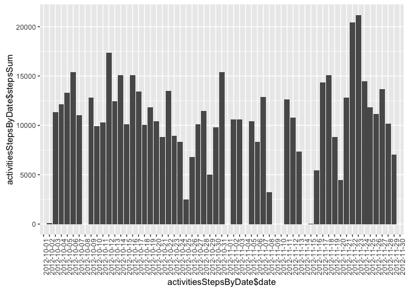
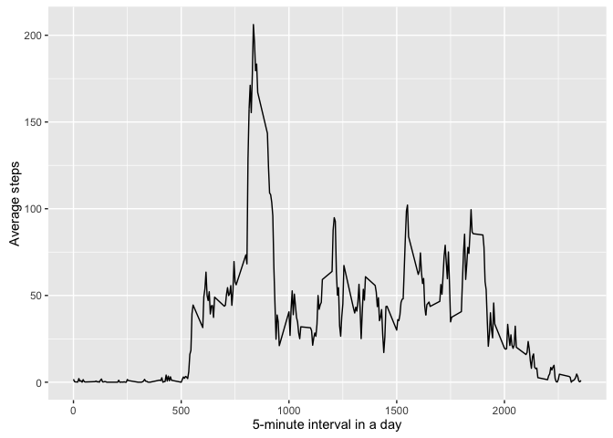
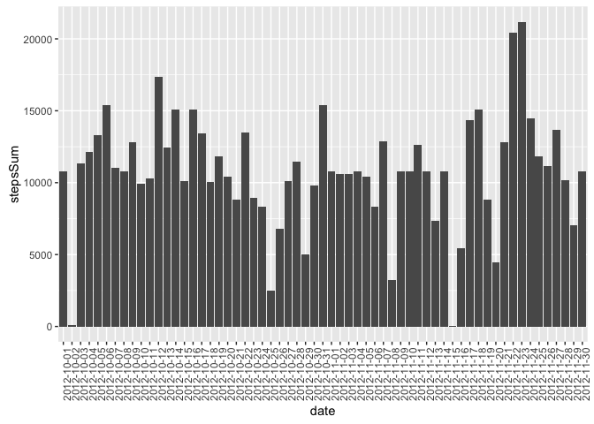
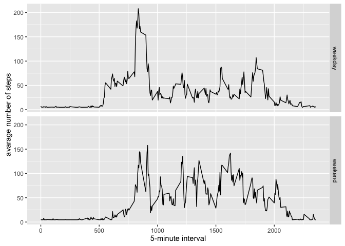

# Reproducible Research: Peer Assessment 1

## Load necessary packages


```r
library(ggplot2)
library(scales)
library(Hmisc)
```

```
## Loading required package: lattice
```

```
## Loading required package: survival
```

```
## Loading required package: Formula
```

```
## 
## Attaching package: 'Hmisc'
```

```
## The following objects are masked from 'package:base':
## 
##     format.pval, round.POSIXt, trunc.POSIXt, units
```

## Loading and preprocessing the data

Downlaod and unzip the data.


```r
FILE_URL <- 'https://d396qusza40orc.cloudfront.net/repdata%2Fdata%2Factivity.zip'
FILE_NAME_ZIP <- 'activity.zip'
FILE_NAME_CSV <- 'activity.csv'

if (!file.exists(FILE_NAME_CSV)) {
  download.file(FILE_URL, destfile=FILE_NAME_ZIP)
  unzip(FILE_NAME_ZIP)
}

activities = read.csv(FILE_NAME_CSV)
```

Get summary of the data.


```r
summary(activities)
```

```
##      steps                date          interval     
##  Min.   :  0.00   2012-10-01:  288   Min.   :   0.0  
##  1st Qu.:  0.00   2012-10-02:  288   1st Qu.: 588.8  
##  Median :  0.00   2012-10-03:  288   Median :1177.5  
##  Mean   : 37.38   2012-10-04:  288   Mean   :1177.5  
##  3rd Qu.: 12.00   2012-10-05:  288   3rd Qu.:1766.2  
##  Max.   :806.00   2012-10-06:  288   Max.   :2355.0  
##  NA's   :2304     (Other)   :15840
```

Notice we have some NAs in `steps`.

## What is mean total number of steps taken per day?

Calculate sum of steps group by dates.


```r
activitiesStepsByDate <- aggregate(
  activities[, c('steps')],
  by=list(activities$date),
  sum,
  na.rm=TRUE)
names(activitiesStepsByDate) <- c('date', 'stepsSum')
head(activitiesStepsByDate)
```

```
##         date stepsSum
## 1 2012-10-01        0
## 2 2012-10-02      126
## 3 2012-10-03    11352
## 4 2012-10-04    12116
## 5 2012-10-05    13294
## 6 2012-10-06    15420
```

Histogram of the total number of steps taken by date. (I am not sure if histogram is a right plot here because histogram is meant for data has continuous x values, but dates are actually not.)


```r
ggplot(data=activitiesStepsByDate,
       aes(activitiesStepsByDate$date, activitiesStepsByDate$stepsSum)) +
  stat_summary(fun.y=sum, geom='bar') +
  theme(axis.text.x = element_text(angle=90, hjust=1))
```

<!-- -->

Calculate and report the mean and median total number of steps taken per day.


```r
activitiesStepsByDateMean = mean(activitiesStepsByDate$stepsSum)
activitiesStepsByDateMid = median(activitiesStepsByDate$stepsSum)
```

* Mean number of steps taken per day: 9354.2295082
* Median number of steps taken per day: 10395

## What is the average daily activity pattern?


```r
activitiesStepsByInterval <- aggregate(
  x=list(meanSteps=activities$steps),
  by=list(interval=activities$interval),
  FUN=mean,
  na.rm=TRUE
) 
```

Make a time series plot.


```r
ggplot(data=activitiesStepsByInterval, aes(x=interval, y=meanSteps)) +
  geom_line() +
  xlab('5-minute interval in a day') +
  ylab('Average steps')
```

<!-- -->

Find the interval with maximum average steps.


```r
maxStepsInterval <- which.max(activitiesStepsByInterval$meanSteps)
```

It's the 104th interval.

## Imputing missing values


```r
countNaSteps = length(which(is.na(activities$steps)))
```

There are 2304 NA steps values.

Fill NA values with mean number.


```r
activitiesImputed <- activities
activitiesImputed$steps <- impute(activitiesImputed$steps, fun=mean)
```

Plot the histogram.


```r
activitiesStepsByDateImputed <- aggregate(
  activitiesImputed[, c('steps')],
  by=list(activitiesImputed$date),
  sum,
  na.rm=TRUE)
names(activitiesStepsByDateImputed) <- c('date', 'stepsSum')

ggplot(data=activitiesStepsByDateImputed,
       aes(date, stepsSum)) +
  stat_summary(fun.y=sum, geom='bar') +
  theme(axis.text.x = element_text(angle=90, hjust=1))
```

<!-- -->

Calculate mean and median.


```r
activitiesStepsByDateMeanImputed = mean(activitiesStepsByDateImputed$stepsSum)
activitiesStepsByDateMidImputed = median(activitiesStepsByDateImputed$stepsSum)
```

* Mean number of steps taken per day (after imputing): 1.0766189\times 10^{4}
* Median number of steps taken per day (after imputing): 1.0766189\times 10^{4}

## Are there differences in activity patterns between weekdays and weekends?

Create a new factor variable in the dataset with two levels – “weekday” and “weekend” indicating whether a given date is a weekday or weekend day.


```r
activitiesImputed$dateType <- ifelse(as.POSIXlt(activitiesImputed$date)$wday %in% c(0,6), 'weekend', 'weekday')
```

Make a panel plot containing a time series plot


```r
averagedActivityDataImputed <- aggregate(steps ~ interval + dateType, data=activitiesImputed, mean)
ggplot(averagedActivityDataImputed, aes(interval, steps)) + 
    geom_line() + 
    facet_grid(dateType ~ .) +
    xlab("5-minute interval") + 
    ylab("avarage number of steps")
```

<!-- -->
